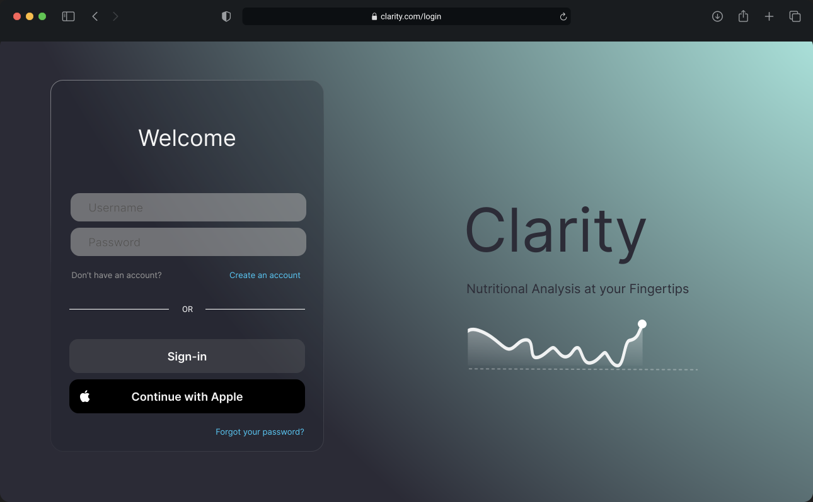

#  Design Project Proposal 

**Project Title 1**  Clarity -  Harnessing AI for Precision Nutrition and Health Analysis

**Project Title 2**  Clarity -  Nutritional Analysis and Health Insights at Your Fingertips

**Name**  Morgan Bergen

**Date Due**  August 30, 2024

**Course**  CS 598 Senior Design Project I

----

<details>
    <summary>Open Toggle to Preview of Application Dashboard</summary>
    <p>
        
    </p>
</details>

----

####  Table of Contents

1.  [Synopsis](#synopsis)
2.  [Introduction](#introduction)
3.  [Project Description](#project-description)
4.  [Design](#design)
5.  [Implementation Plan](#implementation-plan)
6.  [Expected Outcomes](#expected-outcomes)
7.  [Resource Requirements](#resource-requirements)
8.  [References](#references)

----

##  Synopsis

####  Summary

Clarity is a web and mobile application that leverages image recognition and machine learning to analyze the nutritional content of food and comprehensive health management tool.  Designed to empower users with real time dietary insights and transform the way individuals manage their chronic conditions, nutrition, and overall health.

####  How it works

Users captures or uploads images or scan barcodes of their food using Clarity.  The app then provides comprehensive nutritional analysis, dietary trends, and provide personalized recommendations based on the user's health goals or chronic conditions.  Clarity can also predicts or mitigates disease risk factors, and allocates data for health care providers.  

####  Who benefits

1.  **Patients with Chronic Conditions** -  Clarity assist those needing dietary monitoring, such as diabetes, hypertension, heart disease, and obesity.  Clarity can help patients manage their conditions and provide their healthcare providers with data to make informed decisions.

2.  **Insured Individuals** -  Users seeking to reduce healthcare costs will find Clarity invaluable for incentive programs that help reduce insurance premiums based on health data.

3.  **Athletes** -  Optimize performance and recovery with nutritional insights and recommendations.

4.  **Personal Trainers** -  To track their clients' progress and provide personalized recommendations to achieve their health and fitness goals.

5.  **Health-conscious Individuals** -  Anyone looking to enhance their well-being to make more informed dietary choices, track trends, prevent disease, and improve overall health.

##  Introduction

####  Background Information

[Most chronic disease are caused by risk factors such as poor nutrition and excessive alcohol use.](https://www.cdc.gov/chronic-disease/prevention/index.html#:~:text=Most%20chronic%20diseases%20are%20caused,feeling%20good%2C%20and%20living%20longer.)  By avoiding these risks and receiving good preventative care Clarity can help reduce the risk of chronic diseases.

####  Problem Statement

The current healthcare system is intervention based and reactive.  Clarity aims to be proactive and preventative by providing users and healthcare providers with real-time data to make informed decisions about their health.

####  Objectives

1.  Nutritional Analysis and Insights
2.  Personalized Dietary Recommendations
3.  Health Monitoring and Trend Analysis
4.  Disease Risk Management
5.  Data Sharing with Healthcare Providers
6.  Reduce Healthcare Costs
7.  Support Athletic Performance and Personal Training
8.  Enhance Overall Health and Well-being

Nutritional Analysis and Insights -  Insights into macronutrient and micronutrient in take.  Inform users about carcinogens, pesticides, heavy metals, mycotoxins, artificial additives, trans fats, acrylamide, and other harmful substances in their food.

Personalized Dietary Recommendations -  Help users meet specific nutritional needs, such as managing cholesterol, blood sugar, blood pressure, or weight through personalized recommendations.  Provide users with meal plans, recipes, and grocery lists.

Health Monitoring and Trend Analysis -  Track dietary trends, allow users to log biometric data (integrated with wearables or medical devices such as glucose monitors, blood pressure monitors)

Disease Risk Management -  Use dietary data to predict potential health risks and offer preventive guidance to mitigate these risks.

Data Sharing with Healthcare Providers -  Allow users to share their nutritional data with healthcare providers by exporting reports into formats such as PDF, CSV, through API integrations, or HL7 (Health Level Seven International), CDA (Clinical Document Architecture), or FHIR (Fast Healthcare Interoperability Resources) standards.

Reduce Healthcare Costs -  Incentivize users to reduce healthcare costs by providing data to insurance companies for premium reductions.

Support Athletic Performance and Personal Training -  Provide athletes and personal trainers with nutritional insights to optimize performance and recovery.

Enhance Overall Health and Well-being -  Empower users to make informed dietary choices, track trends, prevent disease, and improve overall health.

##  Project Description

Clarity will be using the following features to achieve the objectives of the project:

1.  user profile and data input

users provide their specific information, including age, gender, weight, medical history, medications, and other relevant health data.  the user can set specific health goals related to their dietary needs, such as managing diabetes, losing weight, or improving overall wellness.

2.  mobile device image capture

users capture images of their meals using a mobile device.  the software should be user friendly and guide users on how to take clear and useful photos for analysis.

3.  image analysis and nutritional data extraction

[ai powered analysis](https://openfoodfacts.github.io/openfoodfacts-server/) will consist of uploaded images to a desktop software where machine learning algorithms analyze the food items for nutritional content, portion sizes, and dietary composition.

The app allows users to scan the barcode of products, to view the product information, and to take and submit pictures and data for missing products. [ios app](https://github.com/openfoodfacts/openfoodfacts-ios)  

Nutritional Data Extraction

```JSON
[
  {
    "timestamp": "yyyy-mm-ddThh:mn:ssZ",
    "transaction": [
        {
            "location": "",
            "vendor": "",
            "vendor-id": ""
        }
    ],

    "general": [
        {
            // Barcode of the product
            "code": "200-EAN-13",

            // URL of the product page
            "url": "https://xxx.com",
            
            // Date that the product was added (UNIX timestamp format)
            "created_t": "yyyy-mm-ddThh:mn:ssZ",

            // Date that the product was last modified (UNIX timestamp format)
            "last_modified_t": "yyyy-mm-ddThh:mn:ssZ",

            // Name of the product
            "product_name": "cherios",

            // Generic name of the product
            "generic_name": "cereal",

            // Field that designates quantity and unit size
            "quantity":  _100g
        }
    ],
    "tags" : [
        {
            "packaging": shape, material,
            "packaging_tags": "",
            "brands": "",
            "brand_tags": "", 
            "categories": "",
            "categories_fr": "",
            "origins": "origins of ingredients",
            "origintags": "",
            // Locations where manufactured or transformed
            "manufacturing_places": "",
            "manufacturing_places_atgs": "",
            "labels": "",
            "labels_tags": "",
            "emb_codes": "",
            "emb_code_tags": "",

            // Coordinates corresponding to the first packaging code indicated
            "first_packaging_code_geo": "",
            "cities": "",
            "cities_tags": "",
            "purchase_places": "",
            "stores": "",
            
            // List of countries where the product is sold
            "countries": "",
            "countries_tags": ""
        }
    ],
    "ingredients" : [
        {
            "ingreidents_text": "",
            "traces": "",
            "traces_tags": ""
        }
    ],
    "misc_data" : [
        {
            // Serving size in g
            "serving_side": ...,
            // Indicates if the nutrition facts are indicated on the food label
            "no_nutrients": ...,
            "additives": ...,
            "additives_tags": ...,
            "ingredients_from_palm_oil_n": ...,
            "ingreidents_from_palm_oil": ...,
            "ingreidents_from_palm_oil_tags": ...,
            "ingreidents_that_may_be_from_palm_oil_n": ...,
            "ingreidents_that_may_be_from_palm_oil_tags": ...,
            
            // Nutrition grade ('a' to 'e')
            // Reference: https://fr.openfoodfacts.org/nutriscore
            "nutrition_grade_fr": "a",

            "main_category": ...,
        }
    ],

    "nutrition_facts": [
        {
            "energy_100g": ...,
            "energy-kj_100g": ...,
            ...
        }
    ],

    "nutrition_facts" : [
        {
            "energy-kcal_100g": ...,
            "proteins_100g": ...,
            "casein_100g": ...,
            "serum-proteins_100g": ...,
            "nucleotides_100g": ...,
            "carbohydrates_100g": ...,
            "sugars_100g": ...,
            "sucrose_100g": ...,
            "glucose_100g": ...,
            "fructose_100g": ...,
            "lactose_100g": ...,
            "maltose_100g": ...,
            "maltodextrins_100g": ...,
            "starch_100g": ...,
            "polyols_100g": ...,
            "fat_100g": ...,
            "saturated-fat_100g": ...,
            "butyric-acid_100g": ...,
            "caproic-acid_100g": ...,
            "caprylic-acid_100g": ...,
            "lauric-acid_100g": ...,
            "myristic-acid_100g": ...,
            "palmitic-acid_100g": ...,
            "stearic-acid_100g": ...,
            "arachidic-acid_100g": ...,
            "behenic-acid_100g": ...,
            "lignoceric-acid_100g": ...,
            "cerotic-acid_100g": ...,
            "motanic-acid_100g": ...,
            "melissic-acid_100g": ...,
            "monounsaturated-fat_100g": ...,
            "polyunsaturated-fat_100g": ...,
            "omega_3-fat_100g": ...,
            "alpha-linolenic-acid_100g": ...,
            "eicosapentaenoic-acid_100g": ...,
            "docosahexaenoic-acid_100g": ...,
            "omega_6-fat_100g": ...,
            "linoleic-acid_100g": ...,
            "arachidonic-acid_100g": ...,
            "gamma-linolenic-acid_100g": ...,
            "dihomo-gamma-linolenic-acid_100g": ...,
            "omega_9-fat_100g": ...,
            "oleic-acid_100g": ...,
            "elaidic-acid_100g": ...,
            "gondoic-acid_100g": ...,
            "mead-acid_100g": ...,
            "erucic-acid_100g": ...,
            "nervonic-acid_100g": ...,
            "trans-fat_100g": ...,
            "cholesterol_100g": ...,
            "fiber_100g": ...,
            "sodium_100g": ...,
            // % vol of alcohol
            "alcohol_100g": ...,
            "vitamin-a_100g": ...,
            "vitamin-d_100g": ...,
            "vitamin-e_100g": ...,
            "vitamin-c_100g": ...,
            "vitamin-b1_100g": ...,
            "vitamin-b2_100g": ...,
            "vitamin-pp_100g": ...,
            "vitamin-b6_100g": ...,
            "vitamin-b9_100g": ...,
            "vitamin-b12_100g": ...,
            // Also known as vitamine b8
            "biotin_100g": ...,
            "pantothenic-acid_100g": ...,
            "silica_100g": ...,
            "bicarbonate_100g": ...,
            "chloride_100g": ...,
            "calcium_100g": ...,
            "phosphorus_100g": ...,
            "iron_100g": ...,
            "magnesium_100g": ...,
            "zinc_100g": ...,
            "copper_100g": ...,
            "manganeses_100g": ...,
            "fluoride_100g": ...,
            "selenium_100g": ...,
            "chromium_100g": ...,
            "molybdenum_100g": ...,
            "iodine_100g": ...,
            "caffeine_100gtaurine_100g": ...,
            // pH (no unit)
            "ph_100g": ..., 
            // % of fruits, vegetables, and nuts (excluding potatoes, yams, manioc)
            "fruits-vegetables-nuts_100g": ...,
        }
    ],

    // Nutri-Score
    // Nutrition score derived from the UK FSA score and adapted for the French market (formula defined by the team of Professor Hercberg)
    "nutrition-score-fr_100g" : "a",

    // Nutrition score defined by the UK Food Standards Administration (FSA)
    "nutrition-score-uk_100g": "a",

  }
] 
```

####  Methodology

####  Tools and Technologies

api integration 

-  Open Food Facts API - For food identification and nutritional information via barcode scanning
-  HealthKit - For integration with health devices and data collection

Technology Stack Ideas

-  language -  typescript 
-  library / framework - react native
-  app function - for cross-platform development and provides a native-like experience
-  firebase - for cloud storage, user authentication, and data handling
-  `react-native-health` for integrating with healthKit
-  platform integration - firebase for cloud storage, user authentication, hosting, and database.
-  additional tools - `redux` for state management, `axios` for https request, jest for unit testing

##  Design

####  Sketches / Models




####  Design Architecture

##  Implementation Plan

####  Timeline

####  Task Allocation

##  Expected Outcomes

####  Use Cases

####  Deliverables

##  Resource Requirements

####  APIs

####  Datasets

####  Libraries

##  References

[uber api](https://developer.uber.com/docs/eats/introduction)

[food labeling](https://www.nal.usda.gov/legacy/aglaw/food-labeling)

[open food facts monitoring](https://github.com/openfoodfacts/openfoodfacts-monitoring)

[open food facts api documentation](https://openfoodfacts.github.io/openfoodfacts-server/api/)

####  Documentation

####  Tools for Development
